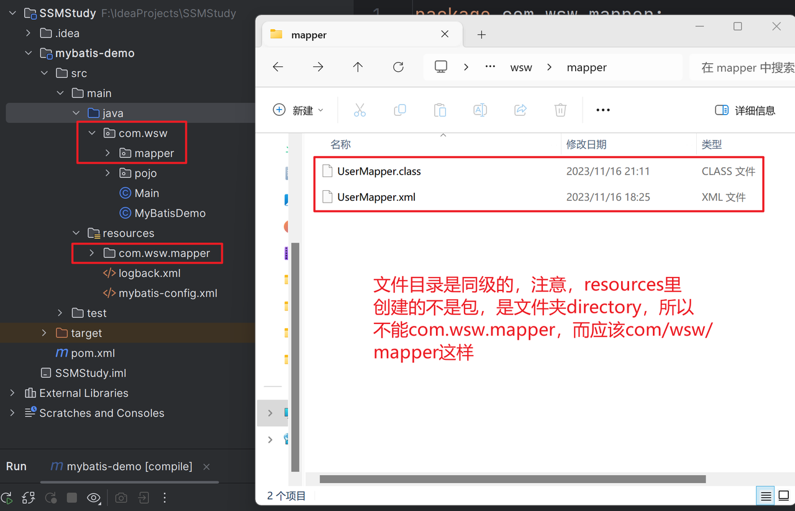
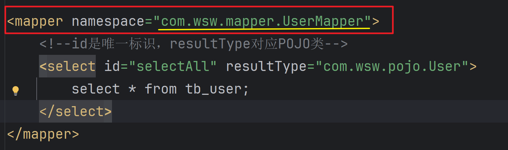
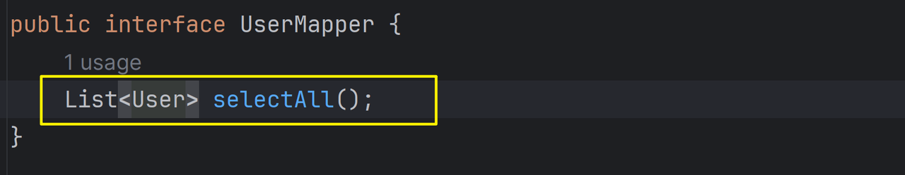
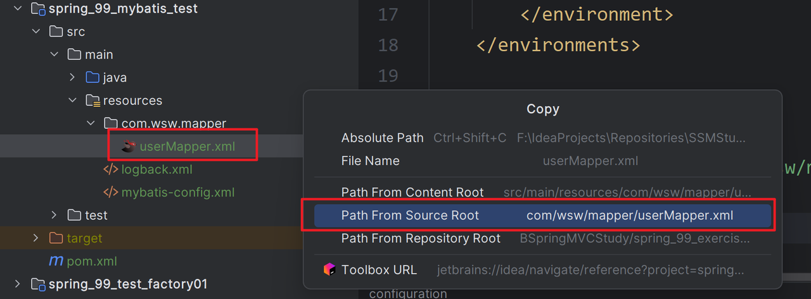
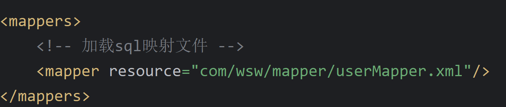

# 使用Mapper代理开发完成入门案例

## 一、Mapper 接口与 SQL 映射文件同目录配置

**描述**：定义与SQL映射文件同名的Mapper接口，并且将Mapper接口和SQL映射文件放置同一目录下



## 二、

**描述**：设置SQL映射文件的namespace属性为Mapper接口全限定名



## 三、

**描述**：在Mapper接口中定义方法，方法名就是SQL映射文件中SQL语句的id，并保持参数类型和返回值类型一致



## 第四步：加载sql映射文件，引用

- 复制：Mapper配置文件源路径地址

  

- 在mybatis-config.xml配置加载映射文件

  

### 第五步

```java
String resource = "mybatis_config.xml";
InputStream inputStream = Resources.getResourceAsStream(resource);
SqlSessionFactory build = new SqlSessionFactoryBuilder().build(inputStream);
SqlSession sqlSession = build.openSession();

UserMapper mapper = sqlSession.getMapper(UserMapper.class);
List<User> objects = (List<User>) mapper.selectAll();
for (User object : objects) {
    System.out.println(object);
}

sqlSession.close();
```


